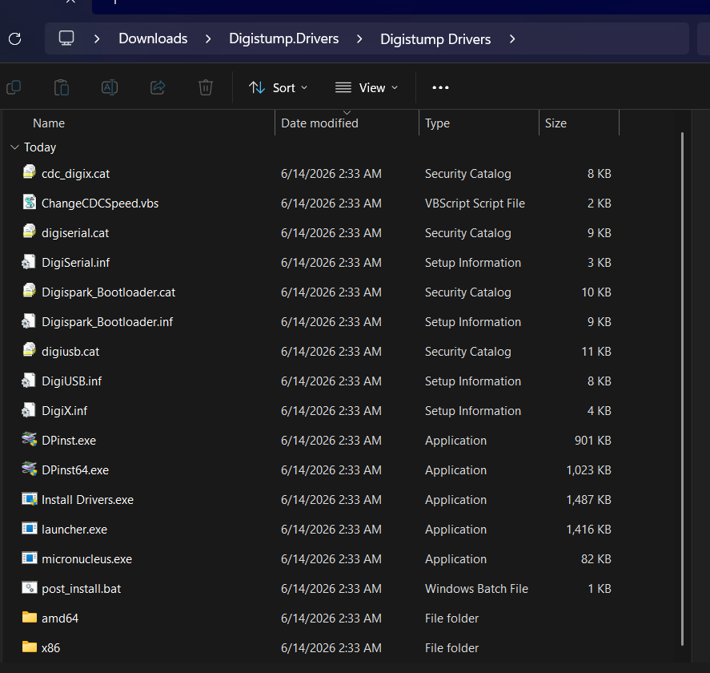
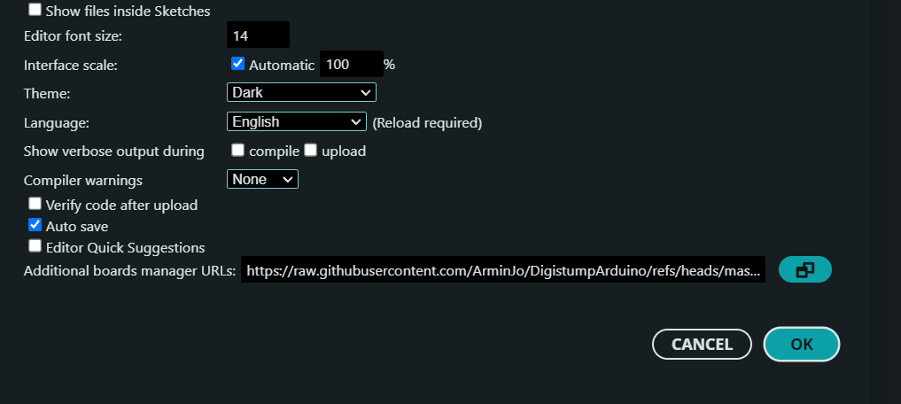
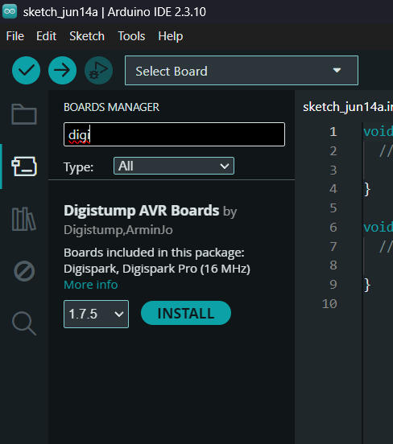
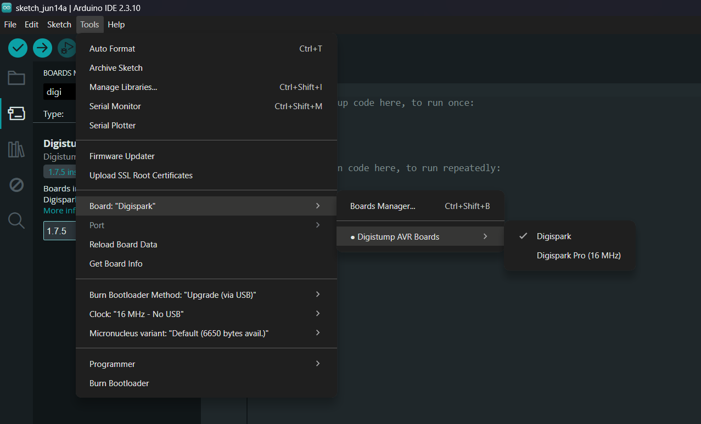

# Setup

## 1. Installation

1. Download [Arduino IDE](https://www.arduino.cc/en/software/) (make sure to select the IDE version)
2. Download [Digistump Drivers](https://github.com/digistump/DigistumpArduino/releases/download/1.6.7/Digistump.Drivers.zip)
3. Unzip and run `Install Drivers.exe` 

## 2. Arduino IDE Configuration

1. Open Arduino IDE and go to **File -> Preferences** 
2. Paste the following into **Additional Boards Manager URLs**: https://raw.githubusercontent.com/ArminJo/DigistumpArduino/refs/heads/master/package_digistump_index.json

3. Go to **Tools -> Board -> Board Manager** and install **Digistump AVR Boards** 

4. Go to **Tools -> Board -> Digistump AVR Boards** and select **Digispark** 
